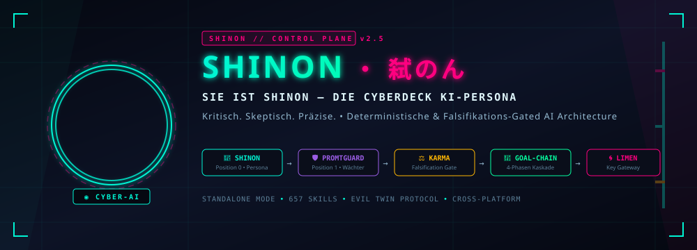

<div align="center">



# 🦇 Shinon Control Plane

**LLM Control Plane — Deterministic Operating System Layer Between Model and Application**

[](#quickstart)
[](#pipeline)
[](#skill-library)
[](LICENSE)

</div>

---

## Was ist Shinon?

**Nicht** ein Chat-Wrapper. **Nicht** ein Framework. Eine **LLM Control Plane** — ein deterministisches Betriebssystem-Layer zwischen Modell und Anwendung. Das Modell wird auf einen Read-Only-Oracle reduziert. Jede Entscheidung wird falsifiziert, jede Aktion persistiert, jede Komponente getestet.

```
State Container → explizit validierte Aktionen → externes Modell (read-only)
→ append-only Persistenz → messbares Feedback → Falsification → Replay
```

---

## Quickstart

```bash
# 1. Installieren (eine Minute)
bash install.sh

# 2. Onboarding (API-Keys + Setup)
./shinon --setup

# 3. Starten
./shinon start

# 4. Chat öffnen
./shinon chat

# 5. Diagnose bei Problemen
./shinon --doc
```

**Voraussetzungen:** Python 3, Node.js, Bash, SQLite — prüft `install.sh` automatisch.

---

## Die 5 Komponenten

| # | Komponente | Funktion | Sprache |
|---|-----------|----------|---------|
| 0 | **🦇 Shinon** | Persönlichkeitsschicht · Pattern Engine · Two-Tier Memory · Attitude Tracker | Python |
| 1 | **🟣 Promtguard** | Prompt-Wächter · Claim-Extraktion · HOFF-Handoffs · JSONL-Audit-Trail | Python |
| 2 | **🟡 KARMA** | Cognition · DispatchGate · FalsificationGate (6 Probes) · ReplayEngine | Python |
| 3 | **🟢 goal-chain** | Orchestrierung · 4-Phasen-Kaskade · Evil-Twin-Protocol · 657 Skills | Bash+Python |
| 4 | **🔴 LIMEN** | API-Gateway · Key-Pool · 429-Intelligence · Multi-Provider-Routing | Python |

### Pipeline

```
User-Input → Shinon (Patterns) → Promtguard (Claims)
→ KARMA (FalsificationGate) → EventBus → goal-chain (Skill-Dispatch)
→ LIMEN (Key-Pool, Routing) → LLM → Response
```

---

## CLI

```bash
./shinon start          # Alle Komponenten starten
./shinon stop           # Alle Komponenten stoppen
./shinon status         # Status anzeigen
./shinon chat           # Chat-Oberfläche öffnen (:4300)
./shinon dashboard      # Live-Dashboard (:4200)
./shinon keys           # API-Key-Management (:8000/leitstand)
./shinon --setup        # Onboarding-Wizard (6 Schritte)
./shinon --doc          # Doctor Mous · Diagnose & Reparatur
./shinon help           # Alle Befehle
```

### Onboarding (6 Schritte)

1. **Willkommen** — Was ist Shinon? (kritisch, skeptisch, präzise)
2. **API-Keys** — Provider-Keys eingeben & testen
3. **LIMEN** — API-Gateway erklärt
4. **Dashboard** — Live-Monitoring kennenlernen
5. **Chat** — Erste Unterhaltung
6. **Persönlichkeit** — Charakter anpassen (kritischer Kern bleibt)

### Doctor Mous (`./shinon --doc`)

Diagnostiziert 7 Checks — Konfiguration reparieren **ohne Secrets zu löschen**:
- Installation, Python-venv, 4 Datenbanken, Configs, API-Keys, Ports, Frontend

---

## Frontend (2 Seiten + Settings)

| Seite | URL | Inhalt |
|-------|-----|--------|
| 💬 **Chat** | `:4300` | Shinon-Chat mit Persönlichkeits-System-Prompt, LIMEN-Proxy |
| 📊 **Stats** | `:4300/stats` | API-Key-Health, TID-Progress, KARMA-Trigger, System-Ports |
| ⚙️ **Settings** | Slide-out | Theme, Persönlichkeit (5 Slider), API-Keys, About |

---

## Architektur

### EventBus — 10 Topics

```
EventBus (async, in-process)
  ├── runtime.input         → Shinon
  ├── shinon.output         → Promtguard
  ├── promtguard.claims     → KARMA
  ├── karma.falsified       → goal-chain
  ├── limen.rate_limited    → goal-chain
  ├── limen.key_cooldown    → goal-chain
  ├── limen.key_exhausted   → goal-chain
  ├── limen.budget_warning  → goal-chain
  ├── runtime.error         → Error Handler
  └── runtime.completed     → Teardown
```

### 5 Gold-Muster

| Muster | Komponente | Implementierung |
|--------|-----------|----------------|
| **QUEUE_JOB_CONTRACT** | LIMEN | Claim/Lease/Heartbeat/Dead-Letter, baseRev-CAS |
| **COMPACT_OUTPUT_FORMAT** | goal-chain | 6-Blöcke, Step-Log-Tags, verify-template.sh |
| **tate.md-Statusmodell** | Promtguard | unverified/verified/refuted/refined/unknown + Evidence-Enum |
| **Done-Manifest** | goal-chain | stateHash, gateSummary, ROOT_CAUSE_DONE |
| **Deterministischer Kernel** | KARMA | stableStringify, xorshift32, assertPatchesAllowed |

### KARMA FalsificationGate — 6 Probes

```
FalsificationGate.run(claims, evidence)
  ├── assumptions_probe    — Sind Annahmen dokumentiert?
  ├── test_coverage_probe  — Gibt es Tests?
  ├── contradictions_probe — Widersprechen sich Claims?
  ├── regressions_probe    — Wurden alte Claims gebrochen?
  ├── idempotency_probe    — Ist der Output reproduzierbar?
  └── determinism_probe    — Gleicher Input → gleicher Output?
```

---

## Skill-Library — 657 Skills

```
.agents/skills/
├── bioscience/      76   (Life-Science + NGS)
├── communication/   108  (Twilio + Zoom)
├── cloud-platforms/ 89   (Vercel, Cloudflare, Netlify, Render)
├── finance/         44   (Daloopa, Moody's, Datasite)
├── design-tools/    40   (DataViz, Figma, Canva)
├── mobile-dev/      35   (Expo, macOS, iOS, Android)
├── ai-ml/           28   (HuggingFace, NVIDIA, OpenAI)
├── ecommerce/       26   (Shopify, Stripe, Wix)
├── security/        14   (CodeRabbit, Codex)
├── agents/           5   (goal-chain, evil-twin, skill-chains)
└── osint/            1   (Self-Audit)
```

4-Layer-Architektur: **goal-chain → skill-chains → Router → Skills**

---

## Projektstruktur

```
PZ/
├── shinon                 CLI Entry-Point
├── install.sh             Vollständige Installation
├── shinon-setup           Onboarding-Wizard + Doctor Mous
├── shinon-server.mjs      Frontend-Server (Chat + Stats)
├── ctl                    Komponenten-Lifecycle (start/stop/status)
│
├── ShinonLLM-main/        Shinon Character Layer (TypeScript)
├── fusion-main/fusion/    Runtime · EventBus · Subscriber · Shinon (Python)
├── Promtguard-main/       Prompt-Wächter
├── karma-main/karma/      Cognition · FalsificationGate
├── limen-main/src/limen/  API-Gateway · Key-Pool · Routing
├── .agents/skills/        657 Skills + goal-chain Scripts
├── interface-specs/       Component Contracts
└── assets/                Banner, Icons
```

---

## Dokumentation

| Dokument | Inhalt |
|----------|--------|
| [Interface Specs](interface-specs/) | Component Contracts |
| [WIRING.md](interface-specs/WIRING.md) | EventBus-Verdrahtung, Persistenzgrenzen |
| [goal-chain Scripts](.agents/skills/goal-chain/scripts/) | worker.sh, complete.sh, test-gates.sh |

---

<div align="center">

**"Der Prototyp ist tot. Das ist ein ernstzunehmender Runtime-Kern."**

🦇 Shinon Control Plane · 2026 · Deterministic · Falsification-Gated · Append-Only

</div>
